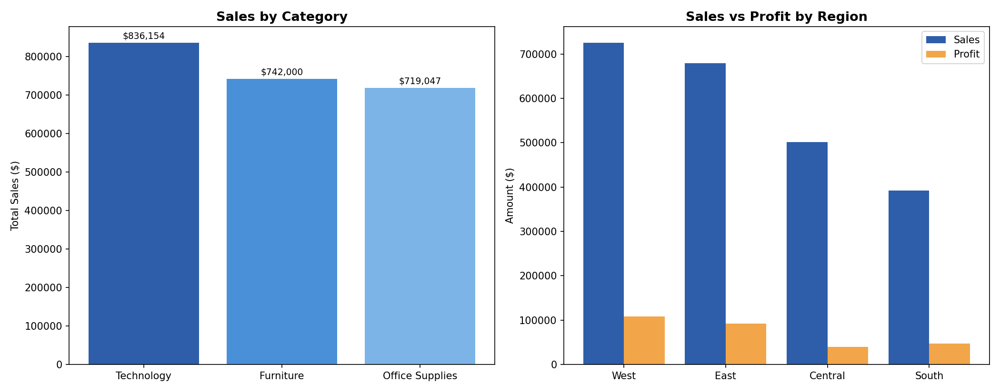

# 🛒 Superstore Sales Analysis (SQL)

SQL-based exploratory analysis of retail sales data to uncover business insights around revenue, top products, customer value, and regional performance.


---

## 📌 Business Context

Retail companies generate large volumes of transactional data but often struggle to translate it into actionable insight. This project simulates a real-world scenario: analyzing a superstore's sales dataset to answer key business questions that a data analyst might be asked by a sales or operations manager — such as which products drive the most revenue, who the top customers are, and which regions are underperforming.

---

## 📂 Dataset

- **Source:** [Superstore Sales Dataset (Kaggle)](https://www.kaggle.com/datasets/vivek468/superstore-dataset-final)
- **Rows:** 9,994 transactions
- **Columns include:** Order ID, Order Date, Customer Name, Segment, Region, Category, Sub-Category, Product Name, Sales, Quantity, Discount, Profit

> To re-run this analysis: download the dataset and place it in the `data/` folder as `superstore.csv`.

---

## 🛠️ Tools Used

- **SQL** (SQLite)
- Python (pandas) for loading data and generating charts

---

## ❓ Questions Answered

| # | Question | Query File |
|---|----------|-----------|
| 1 | What is the total sales revenue? | [`01_total_revenue.sql`](queries/01_total_revenue.sql) |
| 2 | What are the top 5 selling products? | [`02_top_products.sql`](queries/02_top_products.sql) |
| 3 | How do sales break down by category? | [`03_sales_by_category.sql`](queries/03_sales_by_category.sql) |
| 4 | Who are the top 5 customers by revenue? | [`04_top_customers.sql`](queries/04_top_customers.sql) |
| 5 | Which regions perform best? | [`05_regional_performance.sql`](queries/05_regional_performance.sql) |

---

## 🔍 Sample Query

```sql
-- Top 5 selling products by total revenue
SELECT
    Product_Name,
    ROUND(SUM(Sales), 2) AS Total_Sales
FROM orders
GROUP BY Product_Name
ORDER BY Total_Sales DESC
LIMIT 5;
```

---

## 📊 Results & Key Insights

**Total Revenue:** $2,297,200.86 across 9,994 orders

**Top 5 Products by Sales**
| Product | Sales |
|---|---|
| Canon imageCLASS 2200 Advanced Copier | $61,599.82 |
| Fellowes PB500 Electric Punch Plastic Comb Binding Machine | $27,453.38 |
| Cisco TelePresence System EX90 Videoconferencing Unit | $22,638.48 |
| HON 5400 Series Task Chairs for Big and Tall | $21,870.58 |
| GBC DocuBind TL300 Electric Binding System | $19,823.48 |

**Sales by Category**
| Category | Sales |
|---|---|
| Technology | $836,154.03 |
| Furniture | $741,999.80 |
| Office Supplies | $719,047.03 |

**Top 5 Customers by Spend**
| Customer | Total Spent |
|---|---|
| Sean Miller | $25,043.05 |
| Tamara Chand | $19,052.22 |
| Raymond Buch | $15,117.34 |
| Tom Ashbrook | $14,595.62 |
| Adrian Barton | $14,473.57 |

**Sales & Profit by Region**
| Region | Sales | Profit |
|---|---|---|
| West | $725,457.82 | $108,418.45 |
| East | $678,781.24 | $91,522.78 |
| Central | $501,239.89 | $39,706.36 |
| South | $391,721.91 | $46,749.43 |



### 💡 Insights
- **Technology** is the top-performing category ($836K), narrowly ahead of Furniture and Office Supplies.
- The **West region** leads both in total sales ($725K) and profit ($108K), making it the strongest-performing region overall.
- **South region** has the lowest sales ($391K) but generates more profit than Central ($46.7K vs $39.7K) — suggesting Central may have higher discounting or cost inefficiencies worth investigating.
- A small set of high-value customers (led by Sean Miller at $25K) contribute disproportionately to revenue — a good target group for loyalty/retention programs.
- High-ticket office equipment (copiers, binding machines, videoconferencing units) dominates the top-products list, indicating B2B/bulk-office demand drives large individual sale values.

---

## 🚀 How to Run

1. Clone this repository
   ```bash
   git clone https://github.com/ayeshamumtaz1057/superstore-sql-analysis.git
   ```
2. Download the dataset and place it in `data/superstore.csv`
3. Load it into SQLite (or your preferred SQL client):
   ```python
   import pandas as pd, sqlite3
   df = pd.read_csv("data/superstore.csv", encoding="latin1")
   conn = sqlite3.connect("superstore.db")
   df.to_sql("orders", conn, index=False, if_exists="replace")
   ```
4. Run the queries in the `queries/` folder in order

---

## 📁 Repository Structure

```
superstore-sql-analysis/
├── data/
│   └── superstore.csv
├── queries/
│   ├── 01_total_revenue.sql
│   ├── 02_top_products.sql
│   ├── 03_sales_by_category.sql
│   ├── 04_top_customers.sql
│   └── 05_regional_performance.sql
├── results/
│   └── sales_by_category_and_region.png
├── README.md
└── LICENSE
```

---

## 👤 Author

**Ayesha Mumtaz** — IT Student
[GitHub](https://github.com/ayeshamumtaz1057)

---

## 📄 License

This project is licensed under the MIT License — see the [LICENSE](LICENSE) file for details.
